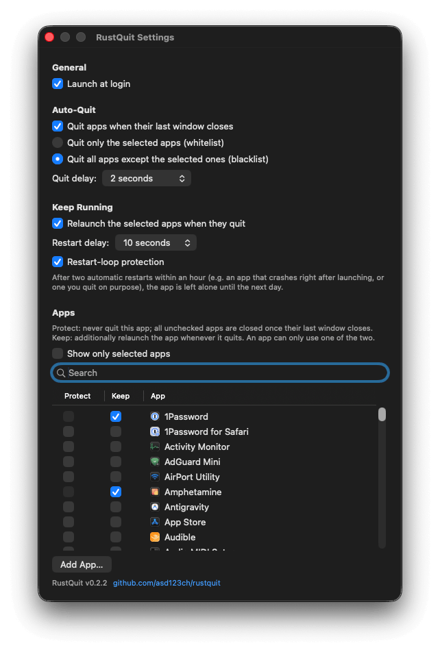

<p align="center">
  
</p>

<h1 align="center">RustQuit</h1>

<p align="center">
  Automatically quits macOS apps when their last window closes.<br>
  A small, defensive <strong>menu bar utility</strong>, built in Rust.
</p>

<p align="center">
  
  <a href="LICENSE"></a>
  
  
  <a href="#privacy"></a>
</p>

<p align="center">
  <a href="#highlights">Highlights</a> ·
  <a href="#features">Features</a> ·
  <a href="#protected-system-apps">Protected apps</a> ·
  <a href="#build--install">Build</a> ·
  <a href="#configuration">Configuration</a> ·
  <a href="#privacy">Privacy</a> ·
  <a href="#credits">Credits</a>
</p>

On macOS, clicking the red ✕ closes a window but leaves the app running.
RustQuit fixes that: when an app's **last window** closes, the app is quit
gracefully, like pressing ⌘Q. It is a from-scratch, native replacement for
the unmaintained [SwiftQuit](https://github.com/onebadidea/swiftquit),
designed around the failure modes that plagued it.

<p align="center">
  
</p>

## Highlights

**Native and small, by design.** No Electron and no web view:
a real AppKit app written in Rust ([`objc2`](https://github.com/madsmtm/objc2)),
a compact native binary that talks to the Accessibility API directly.

**Defensive by architecture.** RustQuit never trusts a cached window count:
it counts again before every decision, and anything it cannot verify keeps
the app alive. The stale-state bugs that crashed SwiftQuit cannot occur by
design.

**Quits reliably where SwiftQuit gave up.** Firefox, iTerm2 and Electron
apps like Discord never delivered the events SwiftQuit waited for — even
Discord's hide-instead-of-close trick is seen through. See
[improvements over SwiftQuit](#improvements-over-swiftquit).

**Keeps apps running, too.** The reverse direction: selected apps are
relaunched automatically after a crash or an update, with a restart-loop
protection so a crashing app is not resurrected forever.

**Safe by default.** Termination is always the polite ⌘Q kind — save
dialogs appear, nothing is ever force-quit — and a
[hard-coded protection list](#protected-system-apps) keeps system
components like Finder untouchable, no matter what the configuration says.

**Private and quiet.** No telemetry, updater, network client or persistent
logs by default. Configuration stays in one user-only local TOML file. See
[Privacy](#privacy).

## Features

- **Whitelist mode** (default): quit only the apps you select
- **Blacklist mode**: quit every app except the ones you select
- **Configurable delay** from 0.05 to 10 s; a window opening within the
  delay cancels the quit (protects against tab-close misfires)
- **Native settings window**: a searchable list of installed apps with
  lazy-loaded icons and checkboxes, a "show only selected apps" toggle,
  plus "Add App…" for anything outside the standard folders
- **Keep running** (the opposite direction): relaunch selected apps
  automatically when they quit, e.g. after a crash or an update. Apps on
  this list are never auto-quit — the two checkboxes are mutually exclusive
  in the app list. **Automatically start missing kept apps** also restores
  apps that are already absent when RustQuit starts and relaunches regular
  apps after normal quits. A related external menu bar helper counts as the
  app suite still running, so closing a settings frontend leaves it closed.
  Relaunches happen **hidden and without
  stealing focus**. A 24-hour ignore temporarily overrides Keep. Optional
  restart-loop protection stops repeated automatic launches until the next
  day.
- **Recently Quit menu**: each app appears once. Kept apps expose Open and a
  24-hour Ignore/Resume action directly in their submenu; other apps open
  immediately. Ignore deadlines persist across RustQuit restarts and expire
  automatically.
- **Launch at login** via SMAppService, toggled in Settings
- **Menu bar status**: shows a single warning submenu only when Accessibility
  access or Launch at Login approval is missing, with direct links to the
  relevant System Settings panes. It disappears automatically when everything
  is ready. The icon dims while auto-quit is disabled.
- **Single instance**: an OS file lock prevents launch races
- Only regular apps (with a Dock presence) are ever considered; menu bar
  utilities, background services and apps without a bundle ID are ignored

## Protected system apps

Some processes must never be quit automatically. RustQuit enforces this in
three layers: they are **excluded from the quit logic**, **hidden from the
app list**, and **rejected with a warning** if added manually via "Add App…".
Even a hand-edited config file cannot make RustQuit touch them.

| Group | Apps |
|---|---|
| Core system UI | Finder, Spotlight, Notification Center, SystemUIServer, Dock, Control Center, WindowManager, TextInputMenuAgent, System Events, loginwindow, CoreServices UI Agent |
| Interruption-sensitive tools | Migration Assistant, Boot Camp Assistant, Disk Utility |
| Accessibility tools | VoiceOver Utility, Magnifier |
| Works without windows | Phone (an active audio call would be dropped) |
| Launcher stubs (never own windows) | Mission Control, Siri, Time Machine, Screenshot, Apps (any `*.launcher` bundle) |
| Itself | RustQuit |

Additionally, **anything under `/System/Library/`** (e.g. CoreServices) is
treated as system infrastructure and protected regardless of its bundle ID.
The list extends SwiftQuit's short hard-coded exclusions with the full core
system UI, interruption-sensitive wizards and accessibility tools.

Other Apple applications such as Terminal, Activity Monitor and System
Settings are not hard-coded exclusions. Add them only after considering
whether their window lifecycle is a suitable signal for termination.

## Improvements over SwiftQuit

RustQuit reimplements SwiftQuit's behavior from scratch and addresses the
recurring problems from its issue tracker:

| SwiftQuit problem | RustQuit approach |
|---|---|
| Silent crashes ([#18](https://github.com/onebadidea/swiftquit/issues/18), [#51](https://github.com/onebadidea/swiftquit/issues/51)) | Fresh recount engine, `Result`-based AX layer, callback panic boundaries |
| Firefox / iTerm2 / Discord never quit ([#26](https://github.com/onebadidea/swiftquit/issues/26), [#27](https://github.com/onebadidea/swiftquit/issues/27), [#25](https://github.com/onebadidea/swiftquit/issues/25)) | Rescue recount on app deactivation (AppKit events, independent of the app's AX quality) + `AXManualAccessibility` nudge for Electron + hidden-window detection for Discord's close-to-background behavior |
| Quit requests sent to background menu-bar apps ([#58](https://github.com/onebadidea/swiftquit/issues/58)) | Only Dock apps are watched, and the activation policy is re-checked at quit time so apps that switch to menu bar mode as their window closes (many Tauri/Electron apps) are never quit |
| Closing a tab quit the app ([#6](https://github.com/onebadidea/swiftquit/issues/6)) | Only `AXStandardWindow` subroles count; delay + fresh re-check before quitting |
| Hidden/minimized/other-Space windows miscounted ([#7](https://github.com/onebadidea/swiftquit/issues/7)) | Fresh AX count each time, CGWindowList cross-check, hidden apps (⌘H) never quit |
| Fixed 2 s delay ([#34](https://github.com/onebadidea/swiftquit/issues/34), [#50](https://github.com/onebadidea/swiftquit/issues/50)) | Delay configurable from 0.05 to 10 s |
| No feedback when the permission is missing ([#54](https://github.com/onebadidea/swiftquit/issues/54), [#19](https://github.com/onebadidea/swiftquit/issues/19)) | Menu warning, Settings deep link, and full observer restart after permission changes |
| Login item unreliable ([#29](https://github.com/onebadidea/swiftquit/issues/29), [#46](https://github.com/onebadidea/swiftquit/issues/46)) | Modern SMAppService API (macOS 13+) |
| Stops working after Space/fullscreen changes ([#48](https://github.com/onebadidea/swiftquit/issues/48)) | Space-change grace period, generation checks, conservative CGWindow veto |

And it stays deliberately small: no learning engine, no cloud sync, no
auto-updater or analytics.

## Requirements

- macOS 13 or newer (Apple Silicon or Intel)
- **Xcode Command Line Tools** for linking against the system frameworks:
  ```sh
  xcode-select --install
  ```
- **Rust** (stable), installed via [rustup](https://rustup.rs):
  ```sh
  curl --proto '=https' --tlsv1.2 -sSf https://sh.rustup.rs | sh
  ```

## Build & install

There is no prebuilt download, on purpose: shipping a ready-made macOS app
that opens without warnings requires a paid Apple Developer account for
notarization. Instead, you build the app on your own Mac: three commands, a
couple of minutes, no Apple account. A locally built app normally does not
receive the quarantine flag, so Gatekeeper usually stays out of the way.
Dependencies are pinned in `Cargo.lock`; `bundle.sh` refuses to update them
implicitly.

```sh
git clone https://github.com/asd123ch/rustquit.git
cd rustquit
scripts/make-signing-identity.sh   # one-time: create a stable signing identity
scripts/bundle.sh                  # builds and signs dist/RustQuit.app
cp -R dist/RustQuit.app /Applications/
open /Applications/RustQuit.app
```

On first launch, macOS asks for the **Accessibility permission**
(System Settings → Privacy & Security → Accessibility). RustQuit needs it to
observe window events; that is the entire reason it exists. Until granted,
the engine idles and the menu bar item shows what to do.

RustQuit does not modify or delete other app bundles, so it does not require
the **App Management** permission. Keep uses the standard NSWorkspace launch
API. When Launch at Login has been registered but still needs user approval,
the menu warning links directly to the Login Items pane.

### Why the signing script matters

Do **not** skip `scripts/make-signing-identity.sh`. macOS ties the
Accessibility permission to the app's *code signing identity*. An ad-hoc
signature changes on every rebuild, so you would have to re-grant the
permission after every build. The script creates a self-signed
**"RustQuit Dev"** certificate in a **dedicated keychain**
(`~/Library/Keychains/rustquit-signing.keychain-db`) with a random password
stored in a user-only file; fully non-interactive, no login-keychain
password prompts, no Apple Developer account, no cost. Grant the permission
once and it survives rebuilds. The bundle uses Hardened Runtime, and the
dedicated keychain is locked again immediately after signing.

To remove it later:

```sh
security delete-keychain ~/Library/Keychains/rustquit-signing.keychain-db
rm -f "$HOME/Library/Application Support/rustquit/signing-keychain-password"
```

## Configuration

Everything is managed from the Settings window (menu bar icon → Settings…).
For reference, the configuration lives in a single TOML file at
`~/Library/Application Support/rustquit/config.toml` (manual edits take
effect on the next launch):

```toml
mode = "whitelist"        # or "blacklist"
quit_delay_secs = 2.0
enabled = true
apps = ["com.apple.TextEdit"]
keep_alive_enabled = true
keep_alive_auto_start_missing = true
keep_alive_delay_secs = 10.0
keep_alive_loop_protection = true
keep_alive_apps = []
keep_alive_ignored_until = {}
```

Values are validated on load and save. The file and its directory are created
with user-only permissions.

## Privacy

RustQuit processes bundle identifiers, app display names and window lifecycle
metadata locally. It does not inspect window titles, document contents,
keyboard input or screen pixels. It contains no network client.

Persistent diagnostic logging is disabled by default. To troubleshoot from a
terminal, run:

```sh
RUSTQUIT_DIAGNOSTICS=1 /Applications/RustQuit.app/Contents/MacOS/rustquit
```

Diagnostic logs are stored in `~/Library/Logs/rustquit/`, limited to seven
daily files and created with `0600` permissions. They contain operational
events and process IDs, but not app names or bundle identifiers.

## Security

RustQuit requires the macOS Accessibility permission to observe window
lifecycle events; that permission grants nothing else in this app. It has
no telemetry, updater, network client, IPC server or privileged helper.

The app is not App-Sandboxed because it must inspect Accessibility elements
owned by other applications. Release bundles use the Hardened Runtime
without exception entitlements. Configuration and optional diagnostic logs
are local, user-only files.

RustQuit always requests normal application termination and never invokes
force-quit. Every termination decision is revalidated against the current
configuration, Accessibility state, window-server state and pending window
events immediately before the request is sent.

To report a suspected vulnerability, please use GitHub's private
vulnerability reporting for this repository instead of a public issue.

## How it works

RustQuit watches every regular app for window events. An event never quits
anything directly — it only triggers a fresh count of the app's real
windows. Minimized windows and windows on other Spaces count as open, and a
Space switch immediately cancels every decision already in flight. Anything
RustQuit cannot check reliably also counts as open: when in doubt, the app
stays. Windows an app only pretends to close are ignored solely for a short
built-in list and only while that app is actually reported hidden.

Once the count reaches zero, RustQuit waits for the configured delay and
then re-checks everything: the app must still be running, still windowless,
not hidden with ⌘H, still a regular Dock app (an app that has switched to
menu bar mode is left alone), and still allowed by the current settings, and
the window server must agree that no visible window or window parked on an
inactive Space remains. Only then is the app asked to quit,
with the same polite request as pressing ⌘Q: save dialogs still appear and
are never bypassed. The app lands in the "Recently Quit" menu once macOS
confirms it actually terminated.

## Known limitations

- Apps that never expose an Accessibility tree cannot be observed; they are
  simply never auto-quit (degraded, not broken).
- Apps that macOS terminates on its own ("Automatic Termination", e.g.
  TextEdit) are sometimes faster than RustQuit; same end result.
- Conservative off-screen window detection can leave some apps running when
  they maintain invisible layer-0 helper windows. This is an intentional
  fail-safe.
- Apps that hide themselves when their last window is closed look exactly
  like apps hidden with ⌘H from the outside, so this special handling is
  limited to a short built-in list (currently Discord). For a listed app,
  hiding it with ⌘H counts as closing it.
- Quitting a kept **menu bar app** by hand brings it back after the
  restart delay — for an app without windows, RustQuit cannot tell that
  quit from a crash worth undoing. With **Automatically start missing kept
  apps** enabled, regular Dock apps also return after a deliberate quit,
  unless a related external menu bar helper is already running. In that
  case, closing the settings frontend does not reopen it.
- The settings window lists apps from `/Applications`,
  `/System/Applications` and `~/Applications`, including nested app folders
  up to two levels deep. Anything else can be added via "Add App…".

## Uninstall

Turn off "Launch at login", quit RustQuit, then remove the app and its local
data:

```sh
rm -rf /Applications/RustQuit.app
rm -rf "$HOME/Library/Application Support/rustquit"
rm -rf "$HOME/Library/Logs/rustquit"
security delete-keychain "$HOME/Library/Keychains/rustquit-signing.keychain-db"
```

You can also remove RustQuit from System Settings → Privacy & Security →
Accessibility.

## Development

```sh
cargo run                            # runs unbundled; warnings on stderr
RUSTQUIT_SHOW_SETTINGS=1 cargo run   # opens the settings window immediately
cargo test --locked --all-targets
cargo clippy --locked --all-targets --all-features -- -D warnings
cargo fmt --all -- --check
cargo audit
```

## Credits

RustQuit stands on the work of open-source projects:

- [objc2](https://github.com/madsmtm/objc2) — native AppKit, Accessibility
  and Core Graphics bindings for Rust.
- [smappservice-rs](https://github.com/gethopp/smappservice-rs) — SMAppService
  wrapper for launch at login.
- serde, toml, tracing and the wider Rust ecosystem.
- [SwiftQuit](https://github.com/onebadidea/swiftquit) by onebadidea for the
  original idea. RustQuit is a clean-room reimplementation: no code was
  copied.

## License

Copyright (c) 2026 asd123.ai.

RustQuit is free software licensed under the
[GNU Affero General Public License, version 3](LICENSE). You may use, study,
modify and redistribute it under those terms.
